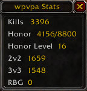

# wpvpa ⚔️

> World of Warcraft (Retail and Classic) AddOn showing PVP stats

It shows Kills, Honor, Honor Level, PVP Standings (Classic or Arena and Rated Battlegrounds)

### VSCode plugins

- [wow-bundle](https://marketplace.visualstudio.com/items?itemName=Septh.wow-bundle)
- [vscode-lua](https://marketplace.visualstudio.com/items?itemName=trixnz.vscode-lua)
  - for MacOS `brew install luarocks && luarocks install luacheck` [luacheck](https://github.com/mpeterv/luacheck)
  - for Windows [luacheck binary](https://github.com/mpeterv/luacheck#windows-binary-download)

## Notes

- In `.toc`, hex color starts right after `|cff`: `## Title: |cffc41f3bwpvpa`

## Packaging and publishing

- [BigWigsMods Packager](https://github.com/BigWigsMods/packager)
- [How to package and publish](https://www.wowinterface.com/forums/showthread.php?t=55801)
- [Github workflows example](https://github.com/mooreatv/NeatMinimap/blob/master/.github/workflows/packaging.yaml)

## Optimizations

- upvalue globals like: `local _G = G`
- `for i = 1, #tbl do local v = tbl[ i ]` instead of  `for i, v in ipairs(tbl) do`
- `string.format('wpvpa: %s', 'hello')` instead of of `("wpvpa: %s"):format('hello')`

### Classic

- [GlobalAPI](https://github.com/Ketho/BlizzardInterfaceResources/blob/classic/Resources/GlobalAPI.lua)
- [Events](https://github.com/Ketho/BlizzardInterfaceResources/blob/classic/Resources/Events.lua)

## URLs

- [Blizzard_APIDocumentation](https://www.townlong-yak.com/framexml/live/Blizzard_APIDocumentation)
- [lua files ptr](https://www.townlong-yak.com/framexml/ptr), example [Blizzard_PVPUI.lua](https://www.townlong-yak.com/framexml/ptr/Blizzard_PVPUI/Blizzard_PVPUI.lua)
- [FontStyles](https://www.townlong-yak.com/framexml/29701/SharedFontStyles.xml)
- [Gethe/wow-api-docs](https://github.com/Gethe/wow-api-docs)
- [AddOn_loading_process](https://wow.gamepedia.com/AddOn_loading_process)
- [Category:FrameXML_documentation](https://wow.gamepedia.com/Category:FrameXML_documentation)
- [Class_colors](https://wow.gamepedia.com/Class_colors)
- [Portal:Interface_customization](https://wowwiki.fandom.com/wiki/Portal:Interface_customization)
- [Saving_variables_between_game_sessions](https://wowwiki.fandom.com/wiki/Saving_variables_between_game_sessions)
- [Widget_API](https://wowwiki.fandom.com/wiki/Widget_API)
- [World_of_Warcraft_API](https://wowwiki.fandom.com/wiki/World_of_Warcraft_API)
- [XML_UI](https://wowwiki.fandom.com/wiki/XML_UI)
- [GlobalStrings](https://www.townlong-yak.com/framexml/beta/GlobalStrings.lua)
- [reddit/wowaddons](https://www.reddit.com/r/wowaddons)
- [phanx resources](https://phanx.net/addons/resources)
- [UI_escape_sequences](https://wow.gamepedia.com/UI_escape_sequences)

### Porting to Classic 1.13.2

- [diff_of_current_classic_vs_live_part_2_framexml](https://www.reddit.com/r/classicwow/comments/bnn2jp/diff_of_current_classic_vs_live_part_2_framexml/)
- [1.13.2 API_changes](https://wow.gamepedia.com/Patch_1.13.2/API_changes)
- [World_of_Warcraft_API#Classic_Specific_Functions](https://wow.gamepedia.com/World_of_Warcraft_API#Classic_Specific_Functions)
- [Porting_addons_to_Classic](https://wow.gamepedia.com/Porting_addons_to_Classic)

### Addons

- [vanilla-wow-addons](https://github.com/ericraio/vanilla-wow-addons)
- [APIinterface](https://www.curseforge.com/wow/addons/apiinterface) `/apii`, `/apiinterface`
- [LuaBrowser](https://www.wowinterface.com/downloads/info12970-LuaBrowser.html) `/lb`, `/lb code <code>`
- [ViragDevTool](https://www.curseforge.com/wow/addons/varrendevtool), [ViragDevTool GitHub](https://github.com/varren/ViragDevTool/)
- [wow-api-docs](https://github.com/Gethe/wow-api-docs) `/api gui`
- [WowLua](https://www.curseforge.com/wow/addons/wowlua) `/lua print(42)`
- [.luacheckrc example](https://github.com/WeakAuras/WeakAuras2/blob/master/.luacheckrc)

### Guides

- [addon guide, mmo-champion](https://www.mmo-champion.com/threads/817817-Creating-Your-Own-WoW-Addon)
- [addon guide, wowhead](https://www.wowhead.com/guide=1949/wow-addon-writing-guide-part-one-how-to-make-your-first-addon)
- [localization guide, phanx](https://phanx.net/addons/tutorials/localize)
- [example of classic and retail](https://github.com/jordonwow/omnibar)

## TODO

> Ordered by priority

- Change UI for both, use modular import
- Improve the UI positions for the multi-language support
- Release a version `0.1.0`
- Publish on [CurseForge](https://authors.curseforge.com/knowledge-base/world-of-warcraft/527-preparing-the-packagemeta-file)
- Publish on [WoWInterface](https://www.wowinterface.com/forums/showthread.php?t=51553)
- Publish post on reddit
- Add multiple styles/themes (example: tooltip)
- Add settings (example: what to show, size)

## [MIT License](LICENSE.md)
